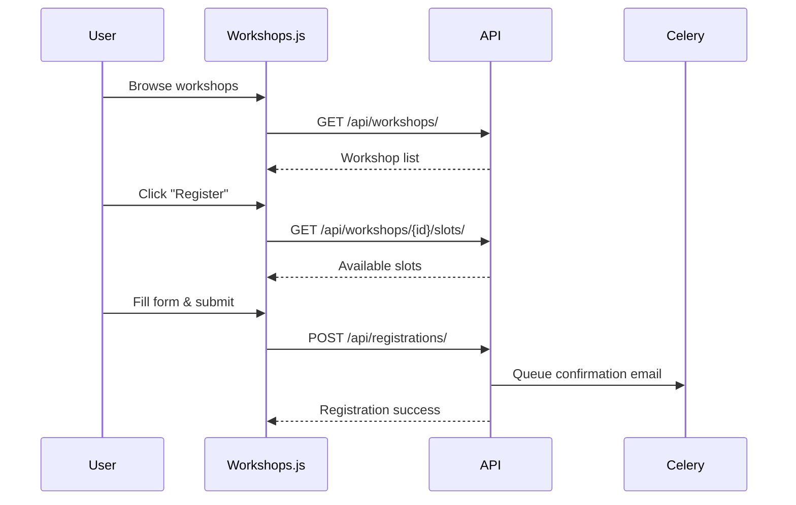
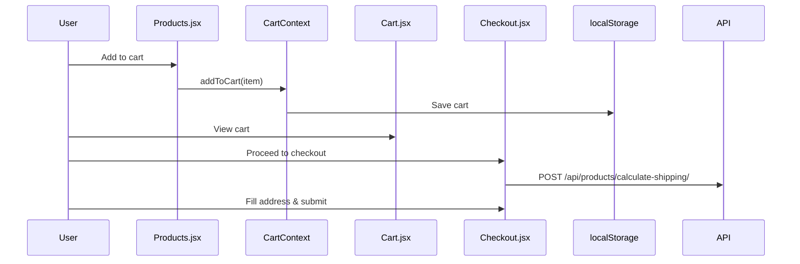
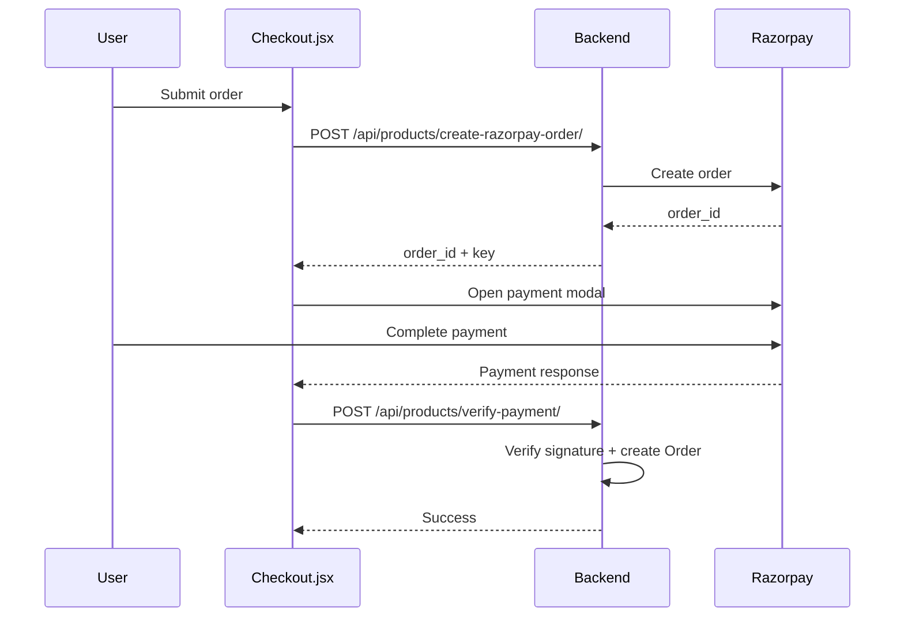

# Basho Codebase Analysis for Chatbot Integration

This document provides a comprehensive analysis of the Basho e-commerce platform codebase to inform chatbot integration planning.

---

## 1. Tech Stack

### Frontend Framework & Libraries
| Technology | Version | Purpose |
|------------|---------|---------|
| **React** | 19.2.3 | Core UI framework (create-react-app) |
| **React Router DOM** | 7.11.0 | Client-side routing |
| **Axios** | 1.13.2 | HTTP client for API calls |
| **Firebase** | 12.7.0 | User authentication |
| **Lucide React** | 0.562.0 | Icon library |

### Backend Framework & API Structure
| Technology | Version | Purpose |
|------------|---------|---------|
| **Django** | 6.0 | Backend framework |
| **Django REST Framework** | 3.16.1 | REST API layer |
| **django-filter** | 24.3 | API filtering |
| **django-cors-headers** | 4.9.0 | CORS handling |
| **django-jazzmin** | 3.0.1 | Admin UI styling |
| **Celery** | 5.3.6 | Async task queue (emails) |
| **Redis** | 5.0.1 | Celery message broker |

### Authentication Mechanism
- **Primary:** Firebase Authentication (frontend)
- **Sync:** Django User model synced via `/api/products/create-user/`
- **Storage:** Cart persisted in localStorage keyed by Firebase UID
- **Guest Support:** Allows unauthenticated checkout

### Payment Integration
| Provider | Integration Type |
|----------|------------------|
| **Razorpay** | Full integration |
| Order Creation | `POST /api/products/create-razorpay-order/` |
| Payment Verification | `POST /api/products/verify-payment/` |

---

## 2. Website Structure

### Frontend Routes (10 Pages)

| Route | Component | Purpose |
|-------|-----------|---------|
| `/` | [Home.jsx](file:///c:/Users/DELL/OneDrive/Desktop/Personal/Projects/Basho/gwoc26_SnowStack/frontend/src/components/Home.jsx) | Landing page with hero, carousel, testimonials |
| `/products` | [Products.jsx](file:///c:/Users/DELL/OneDrive/Desktop/Personal/Projects/Basho/gwoc26_SnowStack/frontend/src/components/Products.jsx) | Product catalog with filtering |
| `/workshops` | [Workshops.js](file:///c:/Users/DELL/OneDrive/Desktop/Personal/Projects/Basho/gwoc26_SnowStack/frontend/src/components/Workshops.js) | Workshop listings + registration forms |
| `/studio` | [Studio.jsx](file:///c:/Users/DELL/OneDrive/Desktop/Personal/Projects/Basho/gwoc26_SnowStack/frontend/src/components/Studio.jsx) | Studio info, exhibitions, gallery |
| `/corporate` | [Corporate.jsx](file:///c:/Users/DELL/OneDrive/Desktop/Personal/Projects/Basho/gwoc26_SnowStack/frontend/src/components/Corporate.jsx) | Corporate/bulk order inquiries |
| `/media` | [Media.jsx](file:///c:/Users/DELL/OneDrive/Desktop/Personal/Projects/Basho/gwoc26_SnowStack/frontend/src/components/Media.jsx) | Press coverage and media content |
| `/cart` | [Cart.jsx](file:///c:/Users/DELL/OneDrive/Desktop/Personal/Projects/Basho/gwoc26_SnowStack/frontend/src/components/Cart.jsx) | Shopping cart view |
| `/checkout` | [Checkout.jsx](file:///c:/Users/DELL/OneDrive/Desktop/Personal/Projects/Basho/gwoc26_SnowStack/frontend/src/components/Checkout.jsx) | Checkout + payment flow |
| `/login` | [Login.jsx](file:///c:/Users/DELL/OneDrive/Desktop/Personal/Projects/Basho/gwoc26_SnowStack/frontend/src/components/Login.jsx) | Firebase login |
| `/signup` | [Signup.jsx](file:///c:/Users/DELL/OneDrive/Desktop/Personal/Projects/Basho/gwoc26_SnowStack/frontend/src/components/Signup.jsx) | Firebase signup |

### Global Layout Components
- [Navigation.js](file:///c:/Users/DELL/OneDrive/Desktop/Personal/Projects/Basho/gwoc26_SnowStack/frontend/src/components/Navigation.js) — Header/navbar (rendered on all pages)
- [Footer.js](file:///c:/Users/DELL/OneDrive/Desktop/Personal/Projects/Basho/gwoc26_SnowStack/frontend/src/components/Footer.js) — Footer (rendered on all pages)

---

## 3. Existing User Flows

### Workshop Registration Flow


### Order Placement Flow (Products)


### Payment Flow (Razorpay)


### Order Tracking Flow
> [!WARNING]
> **No order tracking flow exists.** Currently, orders are created but there is no frontend page to view order history or track status.

---

## 4. Data Availability

### Backend APIs

| Endpoint | Methods | Purpose |
|----------|---------|---------|
| `/api/products/products/` | GET, POST, PUT, DELETE | Product CRUD |
| `/api/products/products/?category=X` | GET | Filter by category |
| `/api/products/products/?search=X` | GET | Search products |
| `/api/products/orders/` | GET, POST | Order management |
| `/api/products/custom-orders/` | GET, POST | Custom order inquiries |
| `/api/products/create-user/` | POST | Sync Firebase user to Django |
| `/api/products/calculate-shipping/` | POST | Calculate shipping cost |
| `/api/products/create-razorpay-order/` | POST | Create Razorpay order |
| `/api/products/verify-payment/` | POST | Verify payment signature |
| `/api/workshops/` | GET | List active workshops |
| `/api/workshops/{id}/slots/` | GET | Get available time slots |
| `/api/slots/` | GET | List all available slots |
| `/api/registrations/` | GET, POST | Workshop registrations |
| `/api/studio/exhibitions/` | GET | Upcoming exhibitions |
| `/api/studio/past-popups/` | GET | Past popup events |
| `/api/studio/gallery/` | GET | Event gallery images |

### Dynamic vs Static Data

| Data Type | Source | Notes |
|-----------|--------|-------|
| Products | Database (dynamic) | Full CRUD via admin |
| Workshops | Database (dynamic) | Includes availability tracking |
| Workshop Slots | Database (dynamic) | Auto-decrements on registration |
| Orders | Database (dynamic) | Created during checkout |
| Exhibitions/Gallery | Database (dynamic) | Managed via Django admin |
| Studio Info (address, policies) | **Static (hardcoded)** | In [Studio.jsx](file:///c:/Users/DELL/OneDrive/Desktop/Personal/Projects/Basho/gwoc26_SnowStack/frontend/src/components/Studio.jsx) |
| Corporate page content | **Static (hardcoded)** | In [Corporate.jsx](file:///c:/Users/DELL/OneDrive/Desktop/Personal/Projects/Basho/gwoc26_SnowStack/frontend/src/components/Corporate.jsx) |

---

## 5. Frontend Integration Points

### Chatbot Widget Injection Location

> [!TIP]
> **Recommended:** Inject chatbot in [App.js](file:///c:/Users/DELL/OneDrive/Desktop/Personal/Projects/Basho/gwoc26_SnowStack/frontend/src/App.js) inside the `<div className="App">` wrapper, after `<Footer />`.

```jsx
// App.js - Recommended injection point
<Router>
  <AuthProvider>
    <CartProvider>
      <div className="App">
        <Navigation />
        <Routes>...</Routes>
        <Footer />
        {/* 👇 INJECT CHATBOT HERE */}
        <ChatbotWidget />
      </div>
    </CartProvider>
  </AuthProvider>
</Router>
```

### Layout Architecture
- **Global Components:** `Navigation` and `Footer` wrap all pages
- **Context Providers:** `AuthProvider` and `CartProvider` are available app-wide
- **No per-page layouts:** Each page is a standalone component

### Available Context for Chatbot
The chatbot can access:
- `useCart()` — Cart state, add/remove items
- `useAuth()` — Current user, login status

---

## 6. Constraints & Risks

### Areas Where Chatbot May Impact UX

| Risk | Description | Recommendation |
|------|-------------|----------------|
| **Checkout interference** | Chatbot overlay may block payment modal | Hide chatbot during Razorpay popup |
| **Mobile overlap** | Fixed chatbot button may overlap cart/nav | Use responsive positioning |
| **Cart sync conflicts** | If chatbot modifies cart, ensure it uses `CartContext` | Always use `addToCart()` from context |

### Files NOT to Modify

| File | Reason |
|------|--------|
| [firebase.js](file:///c:/Users/DELL/OneDrive/Desktop/Personal/Projects/Basho/gwoc26_SnowStack/frontend/src/firebase.js) | Auth configuration |
| [CartContext.js](file:///c:/Users/DELL/OneDrive/Desktop/Personal/Projects/Basho/gwoc26_SnowStack/frontend/src/context/CartContext.js) | Core cart logic |
| [Checkout.jsx](file:///c:/Users/DELL/OneDrive/Desktop/Personal/Projects/Basho/gwoc26_SnowStack/frontend/src/components/Checkout.jsx) | Payment flow (critical) |
| `basho_project/settings.py` | Django configuration |
| `products/views.py` (payment functions) | Razorpay integration |

### Safe Files to Modify

| File | Purpose |
|------|---------|
| [App.js](file:///c:/Users/DELL/OneDrive/Desktop/Personal/Projects/Basho/gwoc26_SnowStack/frontend/src/App.js) | Add chatbot component |
| [App.css](file:///c:/Users/DELL/OneDrive/Desktop/Personal/Projects/Basho/gwoc26_SnowStack/frontend/src/App.css) | Chatbot styling |
| `frontend/src/components/` | Add new chatbot component file |

---

## Summary

This codebase is a well-structured React + Django e-commerce platform for handcrafted ceramics. The recommended chatbot integration point is in `App.js` after the Footer component. The chatbot can leverage existing REST APIs for products, workshops, and orders, and can access cart/auth state through React Context.
